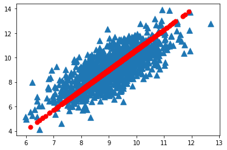
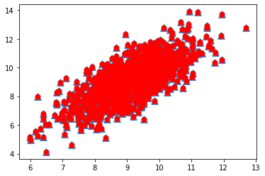

# 1. 降维技术

降维(dimensionality reduction)，定义为降低数据的维度，进而简化数据，简化数据后能获得一些好处：

（1）使得数据集更易使用

（2）降低很多算法的计算开销

（3）去除噪声

（4）使得结果易懂

第一种降维的方法是主成分分析(Principal Component Analysis，PCA)。

在PCA中，数据从原来的坐标系转换到了新的坐标系。第一个新坐标轴选择的是原始数据中方差最大的方向，第二个新坐标轴的选择和第一个坐标轴正交且具有最大方差的方向，该过程一直重复，重复次数为原始数据中特征的数目。可以发现，大部分方差都包含在最前面的几个新坐标轴中，因此，我们可以忽略余下的坐标轴，即对数据进行了降维处理。

第二种降维技术是因子分析(Factor Analysis)。

在因子分析中，我们假设在观察数据的生成中有一些观察不到的隐变量(latent variable)，假设观察数据是这些隐变量和某些噪声的线性组合。那么隐变量的数据可能比观察数据少，也就是说通过找到隐变量就可以实现数据的降维。

第三种降维技术是独立成分分析(Independent Component Analysis，ICA)。

ICA假设数据是从N个数据源生成的，这一点类似因子分析。假设数据为多个数据源的混合观察结果，这些数据源之间在统计上相互独立，而PCA中只是假设数据不相关。如果数据源的数目少于观察数据的数目，则可以实现降维。

# 2. PCA

主成分分析：

优点：降低数据的复杂性，识别最重要的多个特征

缺点：不一定需要，且可能损失有用信息

适用数据类型：数值型数据

## 2.1 移动坐标轴

第一条坐标轴旋转到覆盖数据的最大方差位置，第二条坐标轴与第一条正交(orthogonal)，它就是覆盖数据次大差异性的坐标轴。

通过PCA进行降维处理，可以同时得到SVM和决策树的优点：

一方面：得到了和决策树一样简单的分类器，另一方面，分类间隔和SVM一样好。

通过数据集的协方差矩阵及特征值分析，我们可以求得这些主成分的值，一旦得到了协方差矩阵的特征向量，我们就可以保留最大的N个值。

这些特征向量也给出了N个最重要特征的真实结构，我们可以通过将数据乘上这N个特征向量而将它转换到新的空间。

## 2.2 在NumPy中实现PCA

将数据转换成前N个主成分的伪代码如下：

    去除平均值
    计算协方差矩阵
    计算协方差矩阵的特征值和特征向量
    将特征值从大到小排序
    保留最上面的N个特征向量
    将数据转换到上述N个特征向量构建的新空间中


```python
from numpy import *
import matplotlib.pyplot as plt

def loadDataSet(fileName, delim = '\t'):
    datArr = []
    with open(fileName) as fr:
        stringArr = [line.strip().split(delim) for line in fr.readlines()]
        datArr = [list(map(float, line)) for line in stringArr]
    return array(datArr)

def pca(dataMat, topNfeat = 9999999):
    meanVals = mean(dataMat, axis=0)
    meanRemoved = dataMat - meanVals                #去平均值
    covMat = cov(meanRemoved, rowvar=0)
    eigVals, eigVects = linalg.eig(array(covMat))
    eigValInd = argsort(eigVals)                   #从小到大对N个值排序
    eigValInd = eigValInd[:-(topNfeat+1):-1]
    redEigVects = eigVects[:, eigValInd]
    lowDDataMat = dot(meanRemoved, redEigVects)    #将数据转换到新空间
    reconMat = dot(lowDDataMat, redEigVects.T) + meanVals
    return lowDDataMat, reconMat

dataMat = loadDataSet('testSet.txt')
lowDMat, reconMat = pca(dataMat, 1)
shape(lowDMat)
```


    (1000, 1)


```python
fig = plt.figure()
ax = fig.add_subplot(111)
ax.scatter(dataMat[:, 0].flatten(), dataMat[:, 1].flatten(), marker='^', s=90)
ax.scatter(reconMat[:, 0].flatten(), reconMat[:, 1].flatten(), marker='o', s=50, c='red')
plt.show()
```





可以看到原始数据（原本是二维，蓝色）和降维后的数据（一维，红色）。

如果将N值改为2，会发现重构之后的数据和原始数据重合，即没有剔除任何特征：


```python
lowDMat, reconMat = pca(dataMat, 2)
fig = plt.figure()
ax = fig.add_subplot(111)
ax.scatter(dataMat[:, 0].flatten(), dataMat[:, 1].flatten(), marker='^', s=90)
ax.scatter(reconMat[:, 0].flatten(), reconMat[:, 1].flatten(), marker='o', s=50, c='red')
plt.show()
```





# 3. 示例：利用PCA对半导体制造数据降维


```python
def replaceNanWithMean():
    datMat = loadDataSet('secom.data', ' ')
    numFeat = shape(datMat)[1]
    for i in range(numFeat):
        meanVal = mean(datMat[nonzero(~isnan(datMat[:, i]))[0], i])   #计算所有非NaN的平均值
        datMat[nonzero(isnan(datMat[:, i]))[0], i] = meanVal          #将所有NaN置为平均值
    return datMat

dataMat = replaceNanWithMean()
meanVals = mean(dataMat, axis=0)
meanRemoved = dataMat - meanVals
covMat = cov(meanRemoved, rowvar=0)
eigVals, eigVects = linalg.eig(array(covMat))
eigVals
```


    array([ 5.34151979e+07+0.00000000e+00j,  2.17466719e+07+0.00000000e+00j,
            8.24837662e+06+0.00000000e+00j,  2.07388086e+06+0.00000000e+00j,
            1.31540439e+06+0.00000000e+00j,  4.67693557e+05+0.00000000e+00j,
            2.90863555e+05+0.00000000e+00j,  2.83668601e+05+0.00000000e+00j,
            2.37155830e+05+0.00000000e+00j,  2.08513836e+05+0.00000000e+00j,
            1.96098849e+05+0.00000000e+00j,  1.86856549e+05+0.00000000e+00j,
            1.52422354e+05+0.00000000e+00j,  1.13215032e+05+0.00000000e+00j,
            1.08493848e+05+0.00000000e+00j,  1.02849533e+05+0.00000000e+00j,
            1.00166164e+05+0.00000000e+00j,  8.33473762e+04+0.00000000e+00j,
            8.15850591e+04+0.00000000e+00j,  7.76560524e+04+0.00000000e+00j,
            6.66060410e+04+0.00000000e+00j,  6.52620058e+04+0.00000000e+00j,
            5.96776503e+04+0.00000000e+00j,  5.16269933e+04+0.00000000e+00j,
            5.03324580e+04+0.00000000e+00j,  4.54661746e+04+0.00000000e+00j,
            4.41914029e+04+0.00000000e+00j,  4.15532551e+04+0.00000000e+00j,
            3.55294040e+04+0.00000000e+00j,  3.31436743e+04+0.00000000e+00j,
            2.67385181e+04+0.00000000e+00j,  1.47123429e+04+0.00000000e+00j,
            1.44089194e+04+0.00000000e+00j,  1.09321187e+04+0.00000000e+00j,
            1.04841308e+04+0.00000000e+00j,  9.48876548e+03+0.00000000e+00j,
            8.34665462e+03+0.00000000e+00j,  7.22765535e+03+0.00000000e+00j,
            5.34196392e+03+0.00000000e+00j,  4.95614671e+03+0.00000000e+00j,
            4.23060022e+03+0.00000000e+00j,  4.10673182e+03+0.00000000e+00j,
            3.41199406e+03+0.00000000e+00j,  3.24193522e+03+0.00000000e+00j,
            2.74523635e+03+0.00000000e+00j,  2.35027999e+03+0.00000000e+00j,
            2.16835314e+03+0.00000000e+00j,  1.86414157e+03+0.00000000e+00j,
            1.76741826e+03+0.00000000e+00j,  1.70492093e+03+0.00000000e+00j,
            1.66199683e+03+0.00000000e+00j,  1.53948465e+03+0.00000000e+00j,
            1.33096008e+03+0.00000000e+00j,  1.25591691e+03+0.00000000e+00j,
            1.15509389e+03+0.00000000e+00j,  1.12410108e+03+0.00000000e+00j,
            1.03213798e+03+0.00000000e+00j,  1.00972093e+03+0.00000000e+00j,
            9.50542179e+02+0.00000000e+00j,  9.09791361e+02+0.00000000e+00j,
            8.32001551e+02+0.00000000e+00j,  8.08898242e+02+0.00000000e+00j,
            7.37343627e+02+0.00000000e+00j,  6.87596830e+02+0.00000000e+00j,
            5.64452104e+02+0.00000000e+00j,  5.51812250e+02+0.00000000e+00j,
            5.37209115e+02+0.00000000e+00j,  4.93029995e+02+0.00000000e+00j,
            4.13720573e+02+0.00000000e+00j,  3.90222119e+02+0.00000000e+00j,
            3.37288784e+02+0.00000000e+00j,  3.27558605e+02+0.00000000e+00j,
            3.08869553e+02+0.00000000e+00j,  2.46285839e+02+0.00000000e+00j,
            2.28893093e+02+0.00000000e+00j,  1.96447852e+02+0.00000000e+00j,
            1.75559820e+02+0.00000000e+00j,  1.65795169e+02+0.00000000e+00j,
            1.56428052e+02+0.00000000e+00j,  1.39671194e+02+0.00000000e+00j,
            1.28662864e+02+0.00000000e+00j,  1.15624070e+02+0.00000000e+00j,
            1.10318239e+02+0.00000000e+00j,  1.08663541e+02+0.00000000e+00j,
            1.00695416e+02+0.00000000e+00j,  9.80687852e+01+0.00000000e+00j,
            8.34968275e+01+0.00000000e+00j,  7.53025397e+01+0.00000000e+00j,
            6.89260158e+01+0.00000000e+00j,  6.67786503e+01+0.00000000e+00j,
            6.09412873e+01+0.00000000e+00j,  5.30974002e+01+0.00000000e+00j,
            4.71797825e+01+0.00000000e+00j,  4.50701108e+01+0.00000000e+00j,
            4.41349593e+01+0.00000000e+00j,  4.03313416e+01+0.00000000e+00j,
            3.95741636e+01+0.00000000e+00j,  3.74000035e+01+0.00000000e+00j,
            3.44211326e+01+0.00000000e+00j,  3.30031584e+01+0.00000000e+00j,
            3.03317756e+01+0.00000000e+00j,  2.88994580e+01+0.00000000e+00j,
            2.76478754e+01+0.00000000e+00j,  2.57708695e+01+0.00000000e+00j,
            2.44506430e+01+0.00000000e+00j,  2.31640106e+01+0.00000000e+00j,
            2.26956957e+01+0.00000000e+00j,  2.16925102e+01+0.00000000e+00j,
            2.10114869e+01+0.00000000e+00j,  2.00984697e+01+0.00000000e+00j,
            1.86489543e+01+0.00000000e+00j,  1.83733216e+01+0.00000000e+00j,
            1.72517802e+01+0.00000000e+00j,  1.60481189e+01+0.00000000e+00j,
            1.54406997e+01+0.00000000e+00j,  1.48356499e+01+0.00000000e+00j,
            1.44273357e+01+0.00000000e+00j,  1.42318192e+01+0.00000000e+00j,
            1.35592064e+01+0.00000000e+00j,  1.30696836e+01+0.00000000e+00j,
            1.28193512e+01+0.00000000e+00j,  1.22093626e+01+0.00000000e+00j,
            1.15228376e+01+0.00000000e+00j,  1.12141738e+01+0.00000000e+00j,
            1.02585936e+01+0.00000000e+00j,  9.86906139e+00+0.00000000e+00j,
            9.58794460e+00+0.00000000e+00j,  9.41686288e+00+0.00000000e+00j,
            9.20276340e+00+0.00000000e+00j,  8.63791398e+00+0.00000000e+00j,
            8.20622561e+00+0.00000000e+00j,  8.01020114e+00+0.00000000e+00j,
            7.53391290e+00+0.00000000e+00j,  7.33168361e+00+0.00000000e+00j,
            7.09960245e+00+0.00000000e+00j,  7.02149364e+00+0.00000000e+00j,
            6.76557324e+00+0.00000000e+00j,  6.34504733e+00+0.00000000e+00j,
            6.01919292e+00+0.00000000e+00j,  5.81680918e+00+0.00000000e+00j,
            5.44653788e+00+0.00000000e+00j,  5.12338463e+00+0.00000000e+00j,
            4.79593185e+00+0.00000000e+00j,  4.47851795e+00+0.00000000e+00j,
            4.50369987e+00+0.00000000e+00j,  4.27479386e+00+0.00000000e+00j,
            3.89124198e+00+0.00000000e+00j,  3.56466892e+00+0.00000000e+00j,
            3.32248982e+00+0.00000000e+00j,  2.97665360e+00+0.00000000e+00j,
            2.61425544e+00+0.00000000e+00j,  2.31802829e+00+0.00000000e+00j,
            2.17171124e+00+0.00000000e+00j,  1.99239284e+00+0.00000000e+00j,
            1.96616566e+00+0.00000000e+00j,  1.88149281e+00+0.00000000e+00j,
            1.79228288e+00+0.00000000e+00j,  1.71378363e+00+0.00000000e+00j,
            1.68028783e+00+0.00000000e+00j,  1.60686268e+00+0.00000000e+00j,
            1.47158244e+00+0.00000000e+00j,  1.40656712e+00+0.00000000e+00j,
            1.37808906e+00+0.00000000e+00j,  1.27967672e+00+0.00000000e+00j,
            1.22803716e+00+0.00000000e+00j,  1.18531109e+00+0.00000000e+00j,
            9.38857180e-01+0.00000000e+00j,  9.18222054e-01+0.00000000e+00j,
            8.26265393e-01+0.00000000e+00j,  7.96585842e-01+0.00000000e+00j,
            7.74597255e-01+0.00000000e+00j,  7.14002770e-01+0.00000000e+00j,
            6.79457797e-01+0.00000000e+00j,  6.37928310e-01+0.00000000e+00j,
            6.24646758e-01+0.00000000e+00j,  5.34605353e-01+0.00000000e+00j,
            4.60658687e-01+0.00000000e+00j,  4.24265893e-01+0.00000000e+00j,
            4.08634622e-01+0.00000000e+00j,  3.70321764e-01+0.00000000e+00j,
            3.67016386e-01+0.00000000e+00j,  3.35858033e-01+0.00000000e+00j,
            3.29780397e-01+0.00000000e+00j,  2.94348753e-01+0.00000000e+00j,
            2.84154176e-01+0.00000000e+00j,  2.72703994e-01+0.00000000e+00j,
            2.63265991e-01+0.00000000e+00j,  2.45227786e-01+0.00000000e+00j,
            2.25805135e-01+0.00000000e+00j,  2.22331919e-01+0.00000000e+00j,
            2.13514673e-01+0.00000000e+00j,  1.93961935e-01+0.00000000e+00j,
            1.91647269e-01+0.00000000e+00j,  1.83668491e-01+0.00000000e+00j,
            1.82518017e-01+0.00000000e+00j,  1.65310922e-01+0.00000000e+00j,
            1.57447909e-01+0.00000000e+00j,  1.51263974e-01+0.00000000e+00j,
            1.39427297e-01+0.00000000e+00j,  1.32638882e-01+0.00000000e+00j,
            1.28000027e-01+0.00000000e+00j,  1.13559952e-01+0.00000000e+00j,
            1.12576237e-01+0.00000000e+00j,  1.08809771e-01+0.00000000e+00j,
            1.07136355e-01+0.00000000e+00j,  8.60839655e-02+0.00000000e+00j,
            8.50467792e-02+0.00000000e+00j,  8.29254355e-02+0.00000000e+00j,
            7.03701660e-02+0.00000000e+00j,  6.44475619e-02+0.00000000e+00j,
            6.09866327e-02+0.00000000e+00j,  6.05709478e-02+0.00000000e+00j,
            5.93963958e-02+0.00000000e+00j,  5.22163549e-02+0.00000000e+00j,
            4.92729703e-02+0.00000000e+00j,  4.80022983e-02+0.00000000e+00j,
            4.51487439e-02+0.00000000e+00j,  4.30180504e-02+0.00000000e+00j,
            4.13368324e-02+0.00000000e+00j,  4.03281604e-02+0.00000000e+00j,
            3.91576587e-02+0.00000000e+00j,  3.54198873e-02+0.00000000e+00j,
            3.31199510e-02+0.00000000e+00j,  3.13547234e-02+0.00000000e+00j,
            3.07226509e-02+0.00000000e+00j,  2.98354196e-02+0.00000000e+00j,
            2.81949091e-02+0.00000000e+00j,  2.49158051e-02+0.00000000e+00j,
            2.36374781e-02+0.00000000e+00j,  2.28360210e-02+0.00000000e+00j,
            2.19602047e-02+0.00000000e+00j,  2.00166957e-02+0.00000000e+00j,
            1.86597535e-02+0.00000000e+00j,  1.80415918e-02+0.00000000e+00j,
            1.72261012e-02+0.00000000e+00j,  1.60703860e-02+0.00000000e+00j,
            1.49566735e-02+0.00000000e+00j,  1.40165444e-02+0.00000000e+00j,
            1.31296856e-02+0.00000000e+00j,  1.21358005e-02+0.00000000e+00j,
            1.07166503e-02+0.00000000e+00j,  1.01045695e-02+0.00000000e+00j,
            9.76055340e-03+0.00000000e+00j,  9.16740926e-03+0.00000000e+00j,
            8.78108857e-03+0.00000000e+00j,  8.67465278e-03+0.00000000e+00j,
            8.30918514e-03+0.00000000e+00j,  8.05104488e-03+0.00000000e+00j,
            7.56152126e-03+0.00000000e+00j,  7.31508852e-03+0.00000000e+00j,
            7.26347037e-03+0.00000000e+00j,  6.65728354e-03+0.00000000e+00j,
            6.50769617e-03+0.00000000e+00j,  6.28009879e-03+0.00000000e+00j,
            6.19160730e-03+0.00000000e+00j,  5.64130272e-03+0.00000000e+00j,
            5.30195373e-03+0.00000000e+00j,  5.07453702e-03+0.00000000e+00j,
            4.47372286e-03+0.00000000e+00j,  4.32543895e-03+0.00000000e+00j,
            4.22006582e-03+0.00000000e+00j,  3.97065729e-03+0.00000000e+00j,
            3.75292740e-03+0.00000000e+00j,  3.64861290e-03+0.00000000e+00j,
            3.38915810e-03+0.00000000e+00j,  3.27965962e-03+0.00000000e+00j,
            3.06633825e-03+0.00000000e+00j,  2.99206786e-03+0.00000000e+00j,
            2.83586784e-03+0.00000000e+00j,  2.74987243e-03+0.00000000e+00j,
            2.31066313e-03+0.00000000e+00j,  2.26782346e-03+0.00000000e+00j,
            1.82206662e-03+0.00000000e+00j,  1.74955624e-03+0.00000000e+00j,
            1.69305161e-03+0.00000000e+00j,  1.66624597e-03+0.00000000e+00j,
            1.55346749e-03+0.00000000e+00j,  1.51278404e-03+0.00000000e+00j,
            1.47296800e-03+0.00000000e+00j,  1.33617458e-03+0.00000000e+00j,
            1.30517592e-03+0.00000000e+00j,  1.24056353e-03+0.00000000e+00j,
            1.19823961e-03+0.00000000e+00j,  1.14381059e-03+0.00000000e+00j,
            1.13027458e-03+0.00000000e+00j,  1.11081803e-03+0.00000000e+00j,
            1.08359152e-03+0.00000000e+00j,  1.03517496e-03+0.00000000e+00j,
            1.00164593e-03+0.00000000e+00j,  9.50024605e-04+0.00000000e+00j,
            8.94981182e-04+0.00000000e+00j,  8.74363843e-04+0.00000000e+00j,
            7.98497545e-04+0.00000000e+00j,  7.51612221e-04+0.00000000e+00j,
            6.63964303e-04+0.00000000e+00j,  6.21097650e-04+0.00000000e+00j,
            6.18098606e-04+0.00000000e+00j,  5.72611405e-04+0.00000000e+00j,
            5.57509231e-04+0.00000000e+00j,  5.47002382e-04+0.00000000e+00j,
            5.27195077e-04+0.00000000e+00j,  5.11487997e-04+0.00000000e+00j,
            4.87787872e-04+0.00000000e+00j,  4.74249071e-04+0.00000000e+00j,
            4.52367689e-04+0.00000000e+00j,  4.24431101e-04+0.00000000e+00j,
            4.19119025e-04+0.00000000e+00j,  3.72489906e-04+0.00000000e+00j,
            3.38125455e-04+0.00000000e+00j,  3.34002144e-04+0.00000000e+00j,
            2.97951371e-04+0.00000000e+00j,  2.84845901e-04+0.00000000e+00j,
            2.79038288e-04+0.00000000e+00j,  2.77054476e-04+0.00000000e+00j,
            2.67962797e-04+0.00000000e+00j,  2.54815126e-04+0.00000000e+00j,
            2.29230595e-04+0.00000000e+00j,  1.99245436e-04+0.00000000e+00j,
            1.90381389e-04+0.00000000e+00j,  1.84497913e-04+0.00000000e+00j,
            1.77415682e-04+0.00000000e+00j,  1.68160613e-04+0.00000000e+00j,
            1.63992030e-04+0.00000000e+00j,  1.58025552e-04+0.00000000e+00j,
            1.54226003e-04+0.00000000e+00j,  1.35736724e-04+0.00000000e+00j,
            1.40079891e-04+0.00000000e+00j,  1.46097434e-04+0.00000000e+00j,
            1.46890640e-04+0.00000000e+00j,  1.22704035e-04+0.00000000e+00j,
            1.16752515e-04+0.00000000e+00j,  1.14080847e-04+0.00000000e+00j,
            1.04252870e-04+0.00000000e+00j,  9.90265100e-05+0.00000000e+00j,
            9.66039062e-05+0.00000000e+00j,  9.60766571e-05+0.00000000e+00j,
            9.16166352e-05+0.00000000e+00j,  9.07003479e-05+0.00000000e+00j,
            8.60212634e-05+0.00000000e+00j,  8.32654025e-05+0.00000000e+00j,
            7.70526077e-05+0.00000000e+00j,  7.36470021e-05+0.00000000e+00j,
            7.24998307e-05+0.00000000e+00j,  6.80209910e-05+0.00000000e+00j,
            6.68682704e-05+0.00000000e+00j,  6.14500428e-05+0.00000000e+00j,
            5.99843179e-05+0.00000000e+00j,  5.49918004e-05+0.00000000e+00j,
            5.24646953e-05+0.00000000e+00j,  5.13403844e-05+0.00000000e+00j,
            5.02336259e-05+0.00000000e+00j,  4.89288503e-05+0.00000000e+00j,
            4.51104475e-05+0.00000000e+00j,  4.29823765e-05+0.00000000e+00j,
            4.18869715e-05+0.00000000e+00j,  4.14341562e-05+0.00000000e+00j,
            3.94822845e-05+0.00000000e+00j,  3.80307293e-05+0.00000000e+00j,
            3.57776535e-05+0.00000000e+00j,  3.43901591e-05+0.00000000e+00j,
            2.98089203e-05+0.00000000e+00j,  2.72388358e-05+0.00000000e+00j,
            2.42608885e-05+0.00000000e+00j,  2.30962279e-05+0.00000000e+00j,
            2.27807559e-05+0.00000000e+00j,  2.14440814e-05+0.00000000e+00j,
            1.96208174e-05+0.00000000e+00j,  1.88276186e-05+0.00000000e+00j,
            1.91217363e-05+0.00000000e+00j,  1.66549051e-05+0.00000000e+00j,
            1.46846459e-05+0.00000000e+00j,  1.43753346e-05+0.00000000e+00j,
            1.39779892e-05+0.00000000e+00j,  1.21760519e-05+0.00000000e+00j,
            1.20295834e-05+0.00000000e+00j,  7.36188585e-06+0.00000000e+00j,
            1.13426750e-05+0.00000000e+00j,  1.09258905e-05+0.00000000e+00j,
            8.34247943e-06+0.00000000e+00j,  8.93991856e-06+0.00000000e+00j,
            9.23630200e-06+0.00000000e+00j,  1.02782989e-05+0.00000000e+00j,
            1.01021805e-05+0.00000000e+00j,  9.64538290e-06+0.00000000e+00j,
            9.72678792e-06+0.00000000e+00j,  7.20354827e-06+0.00000000e+00j,
            1.76373602e-06+0.00000000e+00j,  6.69282813e-06+0.00000000e+00j,
            6.49477814e-06+0.00000000e+00j,  5.91044556e-06+0.00000000e+00j,
            6.00244890e-06+0.00000000e+00j,  5.67034892e-06+0.00000000e+00j,
            2.57492503e-06+0.00000000e+00j,  2.66299626e-06+0.00000000e+00j,
            2.78847698e-06+0.00000000e+00j,  5.31392219e-06+0.00000000e+00j,
            5.09342483e-06+0.00000000e+00j,  4.65422045e-06+0.00000000e+00j,
            4.45482133e-06+0.00000000e+00j,  4.11265577e-06+0.00000000e+00j,
            3.77558986e-06+0.00000000e+00j,  3.48065951e-06+0.00000000e+00j,
            3.65202838e-06+0.00000000e+00j,  2.39210233e-06+0.00000000e+00j,
            2.06298821e-06+0.00000000e+00j,  2.00824521e-06+0.00000000e+00j,
            1.10002716e-06+0.00000000e+00j,  1.58273269e-06+0.00000000e+00j,
            1.32211395e-06+0.00000000e+00j,  1.49813697e-06+0.00000000e+00j,
            1.44003524e-06+0.00000000e+00j,  1.42489429e-06+0.00000000e+00j,
            9.01008863e-07+0.00000000e+00j,  8.49881106e-07+0.00000000e+00j,
            7.62521869e-07+0.00000000e+00j,  6.57641104e-07+0.00000000e+00j,
            5.85636641e-07+0.00000000e+00j,  5.33937361e-07+0.00000000e+00j,
            4.16077215e-07+0.00000000e+00j,  2.95575265e-07+0.00000000e+00j,
            3.33765858e-07+0.00000000e+00j,  2.54744632e-07+0.00000000e+00j,
            2.20144574e-07+0.00000000e+00j,  1.86314521e-07+0.00000000e+00j,
            1.77370966e-07+0.00000000e+00j,  1.54794344e-07+0.00000000e+00j,
            1.47331687e-07+0.00000000e+00j,  1.39738552e-07+0.00000000e+00j,
            1.04110968e-07+0.00000000e+00j,  1.00786519e-07+0.00000000e+00j,
            9.38635086e-08+0.00000000e+00j,  9.10853311e-08+0.00000000e+00j,
            8.71546316e-08+0.00000000e+00j,  7.48338889e-08+0.00000000e+00j,
            6.06817433e-08+0.00000000e+00j,  5.66479200e-08+0.00000000e+00j,
            5.24576911e-08+0.00000000e+00j,  4.57020627e-08+0.00000000e+00j,
            2.89942624e-08+0.00000000e+00j,  2.60449427e-08+0.00000000e+00j,
            2.10987990e-08+0.00000000e+00j,  2.17618741e-08+0.00000000e+00j,
            1.75542293e-08+0.00000000e+00j,  1.34637030e-08+0.00000000e+00j,
            1.27167434e-08+0.00000000e+00j,  1.23258200e-08+0.00000000e+00j,
            1.04987513e-08+0.00000000e+00j,  9.86367933e-09+0.00000000e+00j,
            8.49421014e-09+0.00000000e+00j,  9.33428115e-09+0.00000000e+00j,
            7.42188848e-09+0.00000000e+00j,  6.46870496e-09+0.00000000e+00j,
            6.84633774e-09+0.00000000e+00j,  5.76456588e-09+0.00000000e+00j,
            5.01137870e-09+0.00000000e+00j,  3.48686440e-09+0.00000000e+00j,
            2.91267145e-09+0.00000000e+00j,  2.77880630e-09+0.00000000e+00j,
            1.73093444e-09+0.00000000e+00j,  1.42391208e-09+0.00000000e+00j,
            1.16454913e-09+0.00000000e+00j,  1.11815771e-09+0.00000000e+00j,
            9.24977311e-10+0.00000000e+00j,  6.95075292e-10+0.00000000e+00j,
            6.13325325e-10+0.00000000e+00j,  1.80003562e-10+0.00000000e+00j,
            1.97062493e-10+0.00000000e+00j,  2.61902781e-10+0.00000000e+00j,
            5.27610542e-10+0.00000000e+00j,  2.52985138e-15+0.00000000e+00j,
           -3.61429674e-17+1.93290455e-16j, -3.61429674e-17-1.93290455e-16j,
           -8.56880194e-19+0.00000000e+00j,  3.60782540e-18+0.00000000e+00j,
            0.00000000e+00+0.00000000e+00j,  0.00000000e+00+0.00000000e+00j,
            0.00000000e+00+0.00000000e+00j,  0.00000000e+00+0.00000000e+00j,
            0.00000000e+00+0.00000000e+00j,  0.00000000e+00+0.00000000e+00j,
            0.00000000e+00+0.00000000e+00j,  0.00000000e+00+0.00000000e+00j,
            0.00000000e+00+0.00000000e+00j,  0.00000000e+00+0.00000000e+00j,
            0.00000000e+00+0.00000000e+00j,  0.00000000e+00+0.00000000e+00j,
            0.00000000e+00+0.00000000e+00j,  0.00000000e+00+0.00000000e+00j,
            0.00000000e+00+0.00000000e+00j,  0.00000000e+00+0.00000000e+00j,
            0.00000000e+00+0.00000000e+00j,  0.00000000e+00+0.00000000e+00j,
            0.00000000e+00+0.00000000e+00j,  0.00000000e+00+0.00000000e+00j,
            0.00000000e+00+0.00000000e+00j,  0.00000000e+00+0.00000000e+00j,
            0.00000000e+00+0.00000000e+00j,  0.00000000e+00+0.00000000e+00j,
            0.00000000e+00+0.00000000e+00j,  0.00000000e+00+0.00000000e+00j,
            0.00000000e+00+0.00000000e+00j,  0.00000000e+00+0.00000000e+00j,
            0.00000000e+00+0.00000000e+00j,  0.00000000e+00+0.00000000e+00j,
            0.00000000e+00+0.00000000e+00j,  0.00000000e+00+0.00000000e+00j,
            0.00000000e+00+0.00000000e+00j,  0.00000000e+00+0.00000000e+00j,
            0.00000000e+00+0.00000000e+00j,  0.00000000e+00+0.00000000e+00j,
            0.00000000e+00+0.00000000e+00j,  0.00000000e+00+0.00000000e+00j,
            0.00000000e+00+0.00000000e+00j,  0.00000000e+00+0.00000000e+00j,
            0.00000000e+00+0.00000000e+00j,  0.00000000e+00+0.00000000e+00j,
            0.00000000e+00+0.00000000e+00j,  0.00000000e+00+0.00000000e+00j,
            0.00000000e+00+0.00000000e+00j,  0.00000000e+00+0.00000000e+00j,
            0.00000000e+00+0.00000000e+00j,  0.00000000e+00+0.00000000e+00j,
            0.00000000e+00+0.00000000e+00j,  0.00000000e+00+0.00000000e+00j,
            0.00000000e+00+0.00000000e+00j,  0.00000000e+00+0.00000000e+00j,
            0.00000000e+00+0.00000000e+00j,  0.00000000e+00+0.00000000e+00j,
            0.00000000e+00+0.00000000e+00j,  0.00000000e+00+0.00000000e+00j,
            0.00000000e+00+0.00000000e+00j,  0.00000000e+00+0.00000000e+00j,
            0.00000000e+00+0.00000000e+00j,  0.00000000e+00+0.00000000e+00j,
            0.00000000e+00+0.00000000e+00j,  0.00000000e+00+0.00000000e+00j,
            0.00000000e+00+0.00000000e+00j,  0.00000000e+00+0.00000000e+00j,
            0.00000000e+00+0.00000000e+00j,  0.00000000e+00+0.00000000e+00j,
            0.00000000e+00+0.00000000e+00j,  0.00000000e+00+0.00000000e+00j,
            0.00000000e+00+0.00000000e+00j,  0.00000000e+00+0.00000000e+00j,
            0.00000000e+00+0.00000000e+00j,  0.00000000e+00+0.00000000e+00j,
            0.00000000e+00+0.00000000e+00j,  0.00000000e+00+0.00000000e+00j,
            0.00000000e+00+0.00000000e+00j,  0.00000000e+00+0.00000000e+00j,
            0.00000000e+00+0.00000000e+00j,  0.00000000e+00+0.00000000e+00j,
            0.00000000e+00+0.00000000e+00j,  0.00000000e+00+0.00000000e+00j,
            0.00000000e+00+0.00000000e+00j,  0.00000000e+00+0.00000000e+00j,
            0.00000000e+00+0.00000000e+00j,  0.00000000e+00+0.00000000e+00j,
            0.00000000e+00+0.00000000e+00j,  0.00000000e+00+0.00000000e+00j,
            0.00000000e+00+0.00000000e+00j,  0.00000000e+00+0.00000000e+00j,
            0.00000000e+00+0.00000000e+00j,  0.00000000e+00+0.00000000e+00j,
            0.00000000e+00+0.00000000e+00j,  0.00000000e+00+0.00000000e+00j,
            0.00000000e+00+0.00000000e+00j,  0.00000000e+00+0.00000000e+00j,
            0.00000000e+00+0.00000000e+00j,  0.00000000e+00+0.00000000e+00j,
            0.00000000e+00+0.00000000e+00j,  0.00000000e+00+0.00000000e+00j,
            0.00000000e+00+0.00000000e+00j,  0.00000000e+00+0.00000000e+00j,
            0.00000000e+00+0.00000000e+00j,  0.00000000e+00+0.00000000e+00j,
            0.00000000e+00+0.00000000e+00j,  0.00000000e+00+0.00000000e+00j,
            0.00000000e+00+0.00000000e+00j,  0.00000000e+00+0.00000000e+00j,
            0.00000000e+00+0.00000000e+00j,  0.00000000e+00+0.00000000e+00j,
            0.00000000e+00+0.00000000e+00j,  0.00000000e+00+0.00000000e+00j,
            0.00000000e+00+0.00000000e+00j,  0.00000000e+00+0.00000000e+00j,
            0.00000000e+00+0.00000000e+00j,  0.00000000e+00+0.00000000e+00j,
            0.00000000e+00+0.00000000e+00j,  0.00000000e+00+0.00000000e+00j])


观察上述数据，可以发现很多值都是0，实际上，有超过20%的特征值是0，这意味着这些特征都是其他特征的副本，它们可以通过其他特征来表示。

接下来，可以发现，前面15个值的数量级大于$10^5$，实际上那以后的值变得很小，这意味着只有部分重要特征，重要特征的数目也很快下降。

|  主成分   | 方差百分比（%）  |   累积方差百分比（%） |
|  :----:  | :----:  | :----: |
| 1  | 59.2 | 59.2 |
| 2  | 24.1 | 83.4 |
| 3  | 9.2 | 92.5 |
| 4  | 2.3 | 94.8 |
| 5  | 1.5 | 96.3 |
| 6  | 0.5 | 96.8 |
| 7  | 0.3 | 97.1 |
| 20  | 0.08 | 99.3 |

可以看出，前6个主成分覆盖了数据96.8%的方差，而前20个主成分覆盖了99.3%的方差，这表明，如果保留前6个而去除后584个成分，大概可以实现100:1的压缩比。

另外，由于舍弃了噪声的主成分，将后面的主成分去除便使得数据更加干净。
