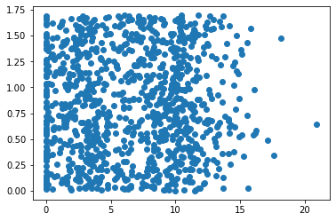
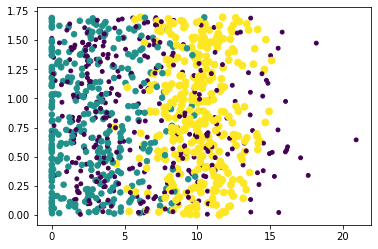

# 1. k-近邻（kNN）算法概述

工作原理：存在一个样本数据集合，并且样本集中每个数据都存在标签。输入没有标签的新数据后，将新数据的每个特征与样本集中数据对应的特征进行比较，然
后算法提取样本集中特征最相似数据（最近邻）的分类标签。通常只选择前k个最相似的数据，k是不大于20的整数。最后选择k个最相似数据中出现次数最多的分类，作为新数据的分类。

优点：精度高、对异常值不敏感、无数据输入假定

缺点：计算复杂度高、空间复杂度高

适用数据范围：数据值和标称型

k-近邻算法的一般流程：

（1）收集数据：可以使用任何方法

（2）准备数据：距离计算所需要的数值，最好是结构化的数据格式

（3）分析数据：可以使用任何方法

（4）训练算法：此步骤不适用于k-近邻算法

（5）测试算法：计算错误率

（6）使用算法：首先需要输入样本数据和结构化的输出结果，然后运行k-近邻算法判定输入数据分别属于哪个分类，最后应用对计算出的分类执行最后的处理

## 1.1 准备：使用Python导入数据


```python
from numpy import *

def createDataSet():
    group = array([[1.0, 1.1], [1.0, 1.0], [0, 0], [0, 0.1]])
    labels = ['A', 'A', 'B', 'B']
    return group, labels

group, labels = createDataSet()
group
```


    array([[1. , 1.1],
           [1. , 1. ],
           [0. , 0. ],
           [0. , 0.1]])


```python
labels
```


    ['A', 'A', 'B', 'B']


## 1.2 实施kNN算法

对未知类别属性的数据集中的每个点依次执行以下操作：

（1）计算已知类别数据集中的点与当前点之间的距离

（2）按照距离递增次序排序

（3）选取与当前点距离最小的k个点

（4）确定前k个点所在类别的出现频率

（5）返回前k个点出现频率最高的类别作为当前点的预测分类


```python
def classify0(inX, dataSet, labels, k):
    dataSetSize = dataSet.shape[0]
    diffMat = tile(inX, (dataSetSize, 1)) - dataSet  #距离计算
    sqDiffMat = diffMat**2
    sqDistances = sqDiffMat.sum(axis=1)
    distances = sqDistances**0.5
    sortedDistIndicies = distances.argsort()
    classCount = {}
    for i in range(k):
        voteIlabel = labels[sortedDistIndicies[i]]
        classCount[voteIlabel] = classCount.get(voteIlabel, 0) + 1                     #选择距离最小的k个点
    sortedClassCount = sorted(classCount.items(), key=lambda x:x[1], reverse=True)   #排序
    return sortedClassCount[0][0]

classify0([0, 0], group, labels, 3)
```


    'B'


# 2. 示例：使用k-近邻算法改进约会网站的配对效果

在约会网站上使用k-近邻算法：

（1）收集数据：提供文本文件

（2）准备数据：使用Python解析文本文件

（3）分析数据：使用Matplotlib画二维扩散图

（4）训练算法：此步骤不适用于k-近邻算法

（5）测试算法：测试样本是已经完成分类的数据，如果预测分类与实际类别不同，则标记为一个错误

（6）使用算法：产生简单的命令行程序

## 2.2 准备数据：从文本文件中解析数据


```python
def file2matrix(filename):
    with open(filename) as fp:
        arrayOLines = fp.readlines()
        numberOfLines = len(arrayOLines)         #得到文件行数
        returnMat = zeros((numberOfLines, 3))    #创建返回的NumPy矩阵
        classLabelVector = []
        index = 0
        for line in arrayOLines:     #解析文件数据到列表
            line = line.strip()
            listFromLine = line.split()
            returnMat[index, :] = listFromLine[0:3]
            classLabelVector.append(int(listFromLine[-1]))
            index += 1
        return returnMat, classLabelVector
    
datingDataMat, datingLabels = file2matrix('datingTestSet.txt')
datingDataMat
```


    array([[4.0920000e+04, 8.3269760e+00, 9.5395200e-01],
           [1.4488000e+04, 7.1534690e+00, 1.6739040e+00],
           [2.6052000e+04, 1.4418710e+00, 8.0512400e-01],
           ...,
           [2.6575000e+04, 1.0650102e+01, 8.6662700e-01],
           [4.8111000e+04, 9.1345280e+00, 7.2804500e-01],
           [4.3757000e+04, 7.8826010e+00, 1.3324460e+00]])


```python
datingLabels[0:20]
```


    [3, 2, 1, 1, 1, 1, 3, 3, 1, 3, 1, 1, 2, 1, 1, 1, 1, 1, 2, 3]


## 分析数据：使用Matplotlib创建散点图


```python
import matplotlib
import matplotlib.pyplot as plt

fig = plt.figure()
ax = fig.add_subplot(111)
ax.scatter(datingDataMat[:, 1], datingDataMat[:, 2])
plt.show()
```





```python
fig = plt.figure()
ax = fig.add_subplot(111)
ax.scatter(datingDataMat[:, 1], datingDataMat[:, 2], 15.0*array(datingLabels), 15.0*array(datingLabels))
plt.show()
```





## 2.3 准备数据：归一化数值

在处理这种不同取值范围的特征值时，通常采用的方法是将数值归一化，如将取值范围处理为0到1或者-1到1之间。

下面的公式可以将任意取值范围的特征值转化为0到1区间内的值：

newValue = (oldValue - min) / (max - min)


```python
def autoNorm(dataSet):
    minVals = dataSet.min(0)
    maxVals = dataSet.max(0)
    ranges = maxVals - minVals
    m = dataSet.shape[0]
    normDataSet = dataSet - tile(minVals, (m, 1))
    normDataSet = normDataSet/tile(ranges, (m, 1))  #特征值相除
    return normDataSet, ranges, minVals

normMat, ranges, minVals = autoNorm(datingDataMat)
normMat
```


    array([[0.44832535, 0.39805139, 0.56233353],
           [0.15873259, 0.34195467, 0.98724416],
           [0.28542943, 0.06892523, 0.47449629],
           ...,
           [0.29115949, 0.50910294, 0.51079493],
           [0.52711097, 0.43665451, 0.4290048 ],
           [0.47940793, 0.3768091 , 0.78571804]])


```python
ranges
```


    array([9.1273000e+04, 2.0919349e+01, 1.6943610e+00])


```python
minVals
```


    array([0.      , 0.      , 0.001156])


## 2.4 测试算法：作为完整程序验证分类器

评估算法的正确率，通常我们只提供已有数据的90%作为训练样本来训练分类器，而使用其余的10%数据去测试分类器，检测分类器的正确率

需要注意的是，10%的测试数据应该是随机选择的


```python
def datingClassTest():
    hoRatio = 0.10
    datingDataMat, datingLabels = file2matrix('datingTestSet.txt')
    normMat, ranges, minVals = autoNorm(datingDataMat)
    m = normMat.shape[0]
    numTestVecs = int(m*hoRatio)
    errorCount = 0.0
    for i in range(numTestVecs):
        classifierResult = classify0(normMat[i, :], normMat[numTestVecs:m, :], datingLabels[numTestVecs:m], 3)
#         print('the classifier came back with: %d, the real answer is: %d' % (classifierResult, datingLabels[i]))
        if classifierResult != datingLabels[i]: errorCount += 1.0
    print('the total error rate is: %f' % (errorCount/numTestVecs))
    
datingClassTest()
```

    the total error rate is: 0.050000
    

## 2.5 使用算法：构建完整可用系统


```python
def classifyPerson():
    resultList = ['not at all', 'in small doses', 'in large doses']
    percentTats = float(input('percentage of time spent playing video games?'))
    ffMiles = float(input('frequent flier miles earned per year?'))
    iceCream = float(input('liters of ice cream consumed per year?'))
    datingDataMat, datingLabels = file2matrix('datingTestSet.txt')
    normMat, ranges, minVals = autoNorm(datingDataMat)
    inArr = array([ffMiles, percentTats, iceCream])
    classifierResult = classify0((inArr-minVals)/ranges, normMat, datingLabels, 3)
    print('you will probably like this person: ', resultList[classifierResult - 1])
    
classifyPerson()
```

    percentage of time spent playing video games?10
    frequent flier miles earned per year?10000
    liters of ice cream consumed per year?0.5
    you will probably like this person:  in small doses
    

# 3. 手写识别系统

使用k-近邻算法的手写识别系统

（1）收集数据：提供文本文件

（2）准备数据：编写函数classify0()，将图像格式转换为分类器使用的list格式

（3）分析数据：在Python命令提示符中检查数据，确保它符合要求

（4）训练算法：此步骤不适用于k-近邻算法

（5）测试算法：编写函数使用提供的部分数据集作为测试样本

（6）使用算法：本例没有完成此步骤

## 3.1 准备数据：将图像转换为测试向量

将一个32x32的二进制图像矩阵转换为1x24的向量


```python
def img2vector(filename):
    returnVect = zeros((1, 1024))
    with open(filename) as fp:
        for i in range(32):
            lineStr = fp.readline()
            for j in range(32):
                returnVect[0, 32*i+j] = int(lineStr[j])
        return returnVect

testVector = img2vector('testDigits/0_13.txt')
testVector[0, 0:31]
```


    array([0., 0., 0., 0., 0., 0., 0., 0., 0., 0., 0., 0., 0., 0., 1., 1., 1.,
           1., 0., 0., 0., 0., 0., 0., 0., 0., 0., 0., 0., 0., 0.])


```python
testVector[0, 32:63]
```


    array([0., 0., 0., 0., 0., 0., 0., 0., 0., 0., 0., 0., 1., 1., 1., 1., 1.,
           1., 1., 0., 0., 0., 0., 0., 0., 0., 0., 0., 0., 0., 0.])


## 3.2 测试算法：使用k-近邻算法识别手写数字


```python
from os import listdir

def handwritingClassTest():
    hwLabels = []
    trainingFileList = listdir('trainingDigits')    #获取目录内容
    m = len(trainingFileList)
    trainingMat = zeros((m, 1024))
    for i in range(m):
        fileNameStr = trainingFileList[i]           #从文件名解析分类数字
        fileStr = fileNameStr.split('.')[0]
        classNumStr = int(fileStr.split('_')[0])
        hwLabels.append(classNumStr)
        trainingMat[i, :] = img2vector('trainingDigits/%s' % fileNameStr)
    testFileList = listdir('testDigits')
    errorcount = 0.0
    mTest = len(testFileList)
    for i in range(mTest):
        fileNameStr = testFileList[i]
        fileStr = fileNameStr.split('.')[0]
        classNumStr = int(fileStr.split('_')[0])
        vectorUnderTest = img2vector('testDigits/%s' % fileNameStr)
        classifierResult = classify0(vectorUnderTest, trainingMat, hwLabels, 3)
#         print('the classifier came back with: %d, the real answer is: %d' % (classifierResult, classNumStr))
        if classifierResult != classNumStr: errorcount += 1.0
    print('\nthe total number of errors is: %d' % errorcount)
    print('\nthe total error rate is: %f' % (errorcount/mTest))
    
handwritingClassTest()
```

    
    the total number of errors is: 10
    
    the total error rate is: 0.010571
    

实际使用这个算法时，算法的执行效率并不高，因为算法需要为每个测试向量做2000次距离计算，每个距离计算包括了1024个维度浮点运算，总计要执行900次

此外，我们还需要为测试向量准备2MB的存储空间。
